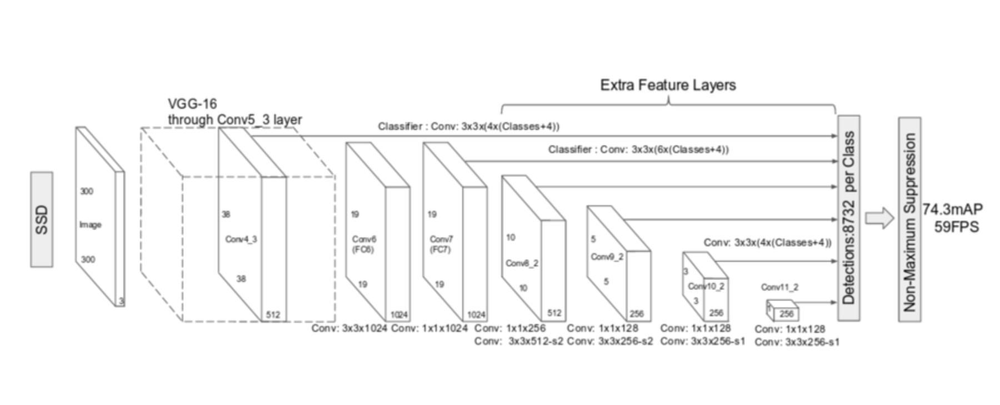

# Introduction
These sample .nml files are for training a Single Shot MultiBox Detector model using image data in [NeoPulse® AI Studio](https://aws.amazon.com/marketplace/pp/B074NDG36S/ref=vdr_rf).

# Model Structure
The SSD model structure uses VGG-16 as base model. As shown in figure 1, it takes conv4_3, fc7, conv6_2, conv7_2, conv8_2, and conv9_2 feature layers to predict both location and class confidences. 



**Fig.1 SSD model with VGG-16 as base. Feature Layer conv4_3, fc7, conv6_2, conv7_2, conv8_2 and conv9_2 are used to predict location and confidence.**

In predicting process, each feature layer is feed into RPN(Regional Proposal Network) to predict class confidence and location coordinates. 


**Fig. 2: RPN structure**

 A set of Anchor Boxes are predefined for each feature layer. Each point in feature map is defined as anchor point. 4 or 6 different default boxes(different ratios and scales) are defined around each anchor point. Classes and location coordinates are predicted based on each anchor box. 


**Fig. 3: 4 different default boxes are defind around one anchor point**

For example, conv6-2 RPN is defined as below in .nml:

```
    conv6_2 
      -> Conv2D:[126, [3,3], padding = "same", kernel_initializer = "he_normal", kernel_regularizer = l2:[0.0005], name = "conv6_2_mbox_conf"]
      -> Reshape: [[-1, 21]]
      -> classes_conv6_2


    conv6_2 
      -> Conv2D:[24, [3,3], padding = "same", kernel_initializer = "he_normal", kernel_regularizer = l2:[0.0005], name = "conv6_2_mbox_loc"]
      -> boxes_conv6_2


    boxes_conv6_2
      -> AnchorBoxes: [300, 300, this_scale = 0.37, next_scale = 0.54, aspect_ratios = [1.0, 2.0, 0.5, 3.0, 0.33], this_steps = 32, this_offsets = 0.5, name = "conv6_2_mbox_priorbox"]
      -> anchors_conv6_2


    boxes_conv6_2
      -> Reshape: [[-1,4]]
      -> boxes_conv6_2

```

In details, Confidence RPN is implemented by 3 * 3 convolution layer. 6 default boxes are defined around each anchor point, and each box is classified into 21 classes (20 onject classes + background), so convolutional layer has 6 * 21 filters. After convolutional layer, prediction results are reshaped as (21,).

```
    conv6_2 
      -> Conv2D:[126, [3,3], padding = "same", kernel_initializer = "he_normal", kernel_regularizer = l2:[0.0005], name = "conv6_2_mbox_conf"]
      -> Reshape: [[-1, 21]]
      -> classes_conv6_2

``` 

Box RPN is also implemented by 3 * 3 convolution layer, which has 24 filters. (24 = 4 * 6, 4 location coordinates and 6 default boxes each anchor point). Then, box predictions are reshaped as (4,).

```
    conv6_2 
      -> Conv2D:[24, [3,3], padding = "same", kernel_initializer = "he_normal", kernel_regularizer = l2:[0.0005], name = "conv6_2_mbox_loc"]
      -> boxes_conv6_2

    boxes_conv6_2
      -> Reshape: [[-1,4]]
      -> boxes_conv6_2

```

Anchor boxes labels for training is created by Layer "AnchorBoxes", which uses intermediate results between box convolution and reshape layer as input. 

```
    boxes_conv6_2
      -> AnchorBoxes: [300, 300, this_scale = 0.37, next_scale = 0.54, aspect_ratios = [1.0, 2.0, 0.5, 3.0, 0.33], this_steps = 32, this_offsets = 0.5, name = "conv6_2_mbox_priorbox"]
      -> anchors_conv6_2

```

In the end, all class and box prediction results across all feature layers need to be concatenated into final output.

```

    [classes_conv4_3, classes_fc7, classes_conv6_2, classes_conv7_2, classes_conv8_2, classes_conv9_2] 
      -> Concatenate:[axis = 1] 
      -> classes_concat

    [boxes_conv4_3, boxes_fc7, boxes_conv6_2, boxes_conv7_2, boxes_conv8_2, boxes_conv9_2]
      -> Concatenate: [axis = 1]
      -> boxes_concat

    [boxes_concat, classes_concat]
      -> Concatenate: [axis = 2]
      -> prediction

```


## Loss
Neopulse support 3 types of loss for Image Detection, SSD loss, Yolo loss, and Focal loss. Users do not need to declare any type of loss. The according loss will be automatically set when users declare typical oracle mode at the beginning of .nml file.


# Data
The data for this task can be found at: http://host.robots.ox.ac.uk/pascal/VOC/voc2012/
To run this example, first you will need to download the raw data and pretrained vgg16 model for the VOC2012 task using the included ```build_csv.py``` script:

```bash
$ python build_csv.py
```

If the script fails, make sure that you have installed all the package dependencies of this script which are: `gzip, os, shutil, pathlib, numpy, requests, imageio, and python-mnist`.

Missing packages can be installed using pip:
```bash
$ pip install <package_name>
```

Once you've downloaded and pre-processed the data, you can start training using any of the NML scripts provided. To begin training:
```bash
$ neopulse train -p <project_name> -path /absolute/path/to/ssd300.nml
```
In NML file, relative path of .csv file is declared in the line:
```bash
bind = "training_data.csv" ;
```

# Tutorial Files
**build_csv.py:** Script creates list of training files and writes training full image paths and corresponding labels to a training CSV file.

**ssd300.nml:** VGG Based detector runs on 300 * 300 Image.

# Tutorial Videos and Guides
Tutorial videos are available in the *Tutorials* section of the [AIDynamics® Developer Portal](https://www.aidynamics.com/ai-developer)


For more information on using the ImageDataGenerator visit the [Data section] of the NeoPulse® AI Studio Documentation(https://docs.neopulse.ai/NML-source/#data)

# License
Tutorial materials are published under the MIT license. See license for commercial, academic, and personal use.
